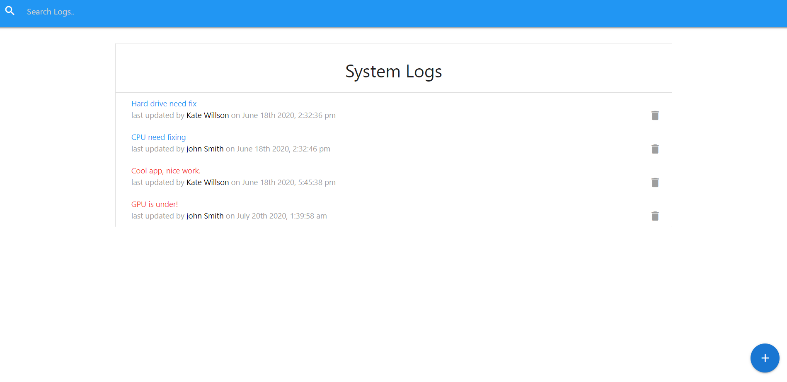

# it-log-board

## Full stack project for IT log board

### what can you do?

Add, Update and Delete Logs
Add and Delete Techs

### Front-end:

- React with Redux

- Materialize and CSS

### Back-end:

- NodeJS with Express

- MongoDB

Deployed to Heroku

